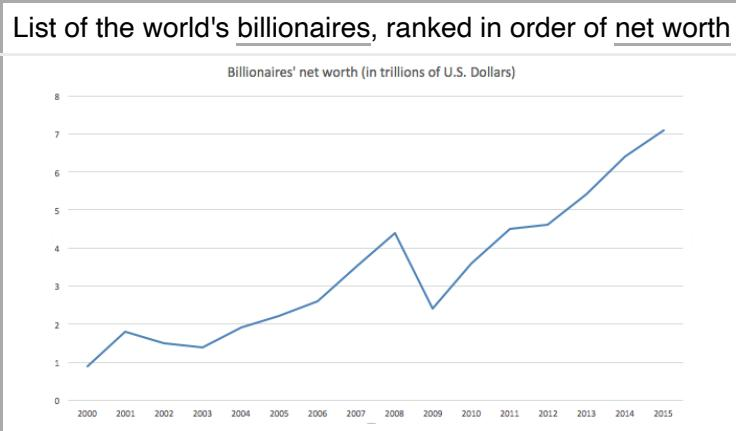

# *The World's Billionaires*

*The World's Billionaires* is an annual ranking of people who are considered to have a [net worth](https://en.wikipedia.org/wiki/Net_worth) of \$1 billion or more, by the American business magazine *[Forbes](https://en.wikipedia.org/wiki/Forbes)*. The list was first published in March 1987.[\[1\]](#page-25-0) The total net worth of each individual on the list is estimated and is cited in [United States dollars](https://en.wikipedia.org/wiki/United_States_dollar), based on their documented assets and accounting for debt and other factors. [Royalty](https://en.wikipedia.org/wiki/Royal_family) and [dictators](https://en.wikipedia.org/wiki/Dictator) whose wealth comes from their positions are excluded from these lists.[\[3\]](#page-25-2) This ranking is an index of the wealthiest documented individuals, excluding any ranking of those with wealth that is not able to be completely ascertained.[\[4\]](#page-25-3)

In 2018, [Amazon](https://en.wikipedia.org/wiki/Amazon_(company)) founder [Jeff Bezos](https://en.wikipedia.org/wiki/Jeff_Bezos) was ranked at the top for the first time and became the first centibillionaire included in the ranking,[\[5\]](#page-25-4) surpassing [Microsoft](https://en.wikipedia.org/wiki/Microsoft) founder Bill [Gates, who had topped the list 18 of the](https://en.wikipedia.org/wiki/Bill_Gates) previous 24 years. In 2022, after topping the [list for four years, Bezos was surpassed by Elon](https://en.wikipedia.org/wiki/Elon_Musk) Musk. [\[6\]](#page-25-5) In 2023, Musk was in turn surpassed by French businessman [Bernard Arnault](https://en.wikipedia.org/wiki/Bernard_Arnault), after topping the list for just a year. Arnault became the first French person to top the list.[\[2\]](#page-25-1)

# **Methodology**

Each year, *Forbes* employs a team of over 50 reporters from a variety of countries to track the activity of the world's wealthiest individuals[\[7\]](#page-25-6) and sometimes groups or families – who share wealth. Preliminary surveys are sent to those who may qualify for the list. According to *Forbes*, they received three types of responses – some people try to inflate their wealth, others cooperate but leave out details,

# *The World's Billionaires*

The net worth of the world's billionaires increased from less than US\$1 trillion in 2000 to over \$7 trillion in 2015.

| Publication details                                                    |                                                            |  |  |  |  |  |
|---------------------------------------------------------------------------|------------------------------------------------------------|--|--|--|--|--|
| Publisher                                                                 | Whale Media Investments                              |  |  |  |  |  |
|                                                                           | Forbes family                                           |  |  |  |  |  |
| Publication                                                               | Forbes                                                     |  |  |  |  |  |
| First published                                                        | [1] March 1987                                       |  |  |  |  |  |
| Latest publication                                                     | April 4, 2023                                        |  |  |  |  |  |
| [2] Current list details (2023)                               |                                                            |  |  |  |  |  |
| Wealthiest                                                                | Bernard Arnault                                         |  |  |  |  |  |
| Net worth (1st)                                                     | US\$211 billion                                         |  |  |  |  |  |
| Number of billionaires                                              | 2,640 (from 2668)                                    |  |  |  |  |  |
| Total list net worth value                                    | US\$12.2 trillion (from US\$ 12.7 trillion) |  |  |  |  |  |
| Number of women                                                     | 337                                                        |  |  |  |  |  |
| New members to the list                                       | 150                                                        |  |  |  |  |  |
| Forbes: The World's Billionaires website (https://www.forb |                                                            |  |  |  |  |  |

[es.com/billionaires/\)](https://www.forbes.com/billionaires/)

and some refuse to answer any questions.[\[8\]](#page-26-0) Business deals are then scrutinized and estimates of valuable assets – land, homes, vehicles, artwork, etc. – are made. Interviews are conducted to vet the figures and improve the estimate of an individual's holdings. Finally, positions in a publicly traded stock are priced to market on a date roughly a month before publication. Privately held companies are priced by the prevailing [price-to-sales](https://en.wikipedia.org/wiki/Price%E2%80%93sales_ratio) or [price-to-earnings](https://en.wikipedia.org/wiki/Price%E2%80%93earnings_ratio) ratios. Known debt is subtracted from assets to get a final estimate of an individual's estimated worth in United States dollars. Since stock prices fluctuate rapidly, an individual's true wealth and ranking at the time of publication may vary from their situation when the list was compiled.[\[7\]](#page-25-6)

When a living individual has dispersed his or her wealth to immediate family members it is included under a single listing (as a single "family fortune") provided that individual (the grantor) is still living. However, if a deceased billionaire's fortune has been dispersed, it will not appear as a single listing, and each recipient will only appear if his or her own total net worth is over a \$Billion (his or her net worth will not be combined with family members')[\[7\]](#page-25-6) [Royal families](https://en.wikipedia.org/wiki/Royal_family) and [dictators](https://en.wikipedia.org/wiki/Dictator) that have their wealth contingent on a position are always excluded from these lists.[\[9\]](#page-26-1)

# **Annual rankings**

The rankings are published annually in March, so the net worths listed are snapshots taken at that time. These lists only show the top 10 wealthiest billionaires for each year.

## **Legend**

| Icon | Description                                |  |  |  |  |  |
|------|--------------------------------------------|--|--|--|--|--|
|      | Has not changed from the previous ranking. |  |  |  |  |  |
|      | Has increased from the previous ranking.   |  |  |  |  |  |
|      | Has decreased from the previous ranking.   |  |  |  |  |  |

# **2023**

In the 37th annual *Forbes* list of the world's billionaires, the list included 2,640 billionaires with a total net wealth of \$12.2 trillion, down 28 members and \$500 billion from 2022. Nearly half the list is poorer than the previous year, including [Elon Musk](https://en.wikipedia.org/wiki/Elon_Musk), who fell from No. 1 to No. 2.[\[2\]](#page-25-1) The list also marks for the first time a French citizen was in the top position as well as a non-American for the first time since 2013 when the Mexican [Carlos Slim Helu](https://en.wikipedia.org/wiki/Carlos_Slim_Helu) was the world's richest person. The list, like in 2022, counted 15 under 30 billionaires with the richest of them being [Red Bull](https://en.wikipedia.org/wiki/Red_Bull) heir [Mark Mateschitz](https://en.wikipedia.org/wiki/Mark_Mateschitz) with a net worth of \$34.7 billion. The youngest of the lot were Clemente Del Vecchio, heir to the [Luxottica](https://en.wikipedia.org/wiki/Luxottica) fortune shared with his six siblings and stepmother and Kim Jung-yang, whose fortune lies in Japanese-South Korean gaming giant [Nexon](https://en.wikipedia.org/wiki/Nexon), both under-20s.[\[10\]](#page-26-2)

| No. | Name                        | Net worth (USD) | Age | Nationality      | Primary source(s) of wealth           |
|-----|-----------------------------|--------------------|-----|------------------|---------------------------------------|
| 1   | Bernard Arnault & family | \$211 billion      | 74  | France           | LVMH                                  |
| 2   | Elon Musk                   | \$180 billion      | 51  | United States | Tesla, SpaceX, X Corp.                |
| 3   | Jeff Bezos                  | \$114 billion      | 59  | United States | Amazon                                |
| 4   | Larry Ellison               | \$107 billion      | 78  | United States | Oracle Corporation                    |
| 5   | Warren Buffett              | \$106 billion      | 92  | United States | Berkshire Hathaway                    |
| 6   | Bill Gates                  | \$104 billion      | 67  | United States | Microsoft                             |
| 7   | Michael Bloomberg           | \$94.5 billion     | 81  | United States | Bloomberg L.P.                        |
| 8   | Carlos Slim & family        | \$93 billion       | 83  | Mexico           | Telmex, América Móvil, Grupo Carso |
| 9   | Mukesh Ambani               | \$83.4 billion     | 65  | India            | Reliance Industries                   |
| 10  | Steve Ballmer               | \$80.7 billion     | 67  | United States | Microsoft                             |

# **2022**

In the 36th annual *Forbes* list of the world's billionaires, the list included 2,668 billionaires with a total net wealth of \$12.7 trillion, down 97 members from 2021.[\[6\]](#page-25-5)

| No. | Name                        | Net worth (USD) | Age | Nationality      | Primary source(s) of wealth |
|-----|-----------------------------|--------------------|-----|------------------|--------------------------------|
| 1   | Elon Musk                   | \$219 billion      | 50  | United States | Tesla, SpaceX, Twitter Inc     |
| 2   | Jeff Bezos                  | \$177 billion      | 58  | United States | Amazon                         |
| 3   | Bernard Arnault & family | \$158 billion      | 73  | France           | LVMH                           |
| 4   | Bill Gates                  | \$129 billion      | 66  | United States | Microsoft                      |
| 5   | Warren Buffett              | \$118 billion      | 91  | United States | Berkshire Hathaway             |
| 6   | Larry Page                  | \$111 billion      | 49  | United States | Alphabet Inc.                  |
| 7   | Sergey Brin                 | \$107 billion      | 48  | United States | Alphabet Inc.                  |
| 8   | Larry Ellison               | \$106 billion      | 77  | United States | Oracle Corporation             |
| 9   | Steve Ballmer               | \$91.4 billion     | 66  | United States | Microsoft                      |
| 10  | Mukesh Ambani               | \$90.7 billion     | 64  | India            | Reliance Industries            |

#### **2021**

In the 35th annual *Forbes* list of the world's billionaires, the list included 2,755 billionaires with a total net wealth of \$13.1 trillion, up 660 members from 2020; 86% of these billionaires had more wealth than they possessed last year.[\[11\]](#page-26-3)[\[12\]](#page-26-4)

| No. | Name                     | Net worth (USD) | Age | Nationality   | Source(s) of wealth |
|-----|--------------------------|-----------------|-----|---------------|---------------------|
| 1   | Jeff Bezos               | \$177 billion   | 57  | United States | Amazon              |
| 2   | Elon Musk                | \$151 billion   | 49  | United States | Tesla, SpaceX       |
| 3   | Bernard Arnault & family | \$150 billion   | 72  | France        | LVMH                |
| 4   | Bill Gates               | \$124 billion   | 65  | United States | Microsoft           |
| 5   | Mark Zuckerberg          | \$97 billion    | 36  | United States | Meta Platforms      |
| 6   | Warren Buffett           | \$96 billion    | 90  | United States | Berkshire Hathaway  |
| 7   | Larry Ellison            | \$93 billion    | 76  | United States | Oracle Corporation  |
| 8   | Larry Page               | \$91.5 billion  | 48  | United States | Alphabet Inc.       |
| 9   | Sergey Brin              | \$89 billion    | 47  | United States | Alphabet Inc.       |
| 10  | Mukesh Ambani            | \$84.5 billion  | 63  | India         | Reliance Industries |

#### **2020**

In the 34th annual *Forbes* list of the world's billionaires, the list included 2,095 billionaires with a total net wealth of \$8 trillion, down 58 members and \$700 billion from 2019; 51% of these billionaires had less wealth than they possessed last year.[\[13\]](#page-26-5) The list was finalized as of 18 March, thus was already partially influenced by the [COVID-19 pandemic.](https://en.wikipedia.org/wiki/COVID-19_pandemic) [\[13\]](#page-26-5)

| No. | Name                     | Net worth (USD) | Age | Nationality   | Source(s) of wealth |
|-----|--------------------------|-----------------|-----|---------------|---------------------|
| 1   | Jeff Bezos               | \$113 billion   | 56  | United States | Amazon              |
| 2   | Bill Gates               | \$98 billion    | 64  | United States | Microsoft           |
| 3   | Bernard Arnault & family | \$76 billion    | 71  | France        | LVMH                |
| 4   | Warren Buffett           | \$67.5 billion  | 89  | United States | Berkshire Hathaway  |
| 5   | Larry Ellison            | \$59 billion    | 75  | United States | Oracle Corporation  |
| 6   | Amancio Ortega           | \$55.1 billion  | 84  | Spain         | Inditex, Zara       |
| 7   | Mark Zuckerberg          | \$54.7 billion  | 35  | United States | Facebook, Inc.      |
| 8   | Jim Walton               | \$54.6 billion  | 71  | United States | Walmart             |
| 9   | Alice Walton             | \$54.4 billion  | 70  | United States | Walmart             |
| 10  | S. Robson Walton         | \$54.1 billion  | 77  | United States | Walmart             |

### 

In the 33rd annual *Forbes* list of the world's billionaires, the list included 2,153 billionaires with a [total net wealth of \\$8.7 trillion, down 55 members and \\$400 billion from 2018.](https://en.wikipedia.org/wiki/List_of_countries_by_the_number_of_billionaires)[\[14\]](#page-26-6) The U.S. continued to have the most billionaires in the world, with a record of 609, while [China](https://en.wikipedia.org/wiki/China) dropped to 324 (when not including [Hong Kong,](https://en.wikipedia.org/wiki/Hong_Kong) [Macau](https://en.wikipedia.org/wiki/Macau) and [Taiwan](https://en.wikipedia.org/wiki/Taiwan)).[\[14\]](#page-26-6)

| No. | Name              | Net worth (USD) | Age | Nationality   | Source(s) of wealth        |
|-----|-------------------|-----------------|-----|---------------|----------------------------|
| 1   | Jeff Bezos        | \$131 billion   | 55  | United States | Amazon                     |
| 2   | Bill Gates        | \$96.5 billion  | 63  | United States | Microsoft                  |
| 3   | Warren Buffett    | \$82.5 billion  | 88  | United States | Berkshire Hathaway         |
| 4   | Bernard Arnault   | \$76 billion    | 70  | France        | LVMH                       |
| 5   | Carlos Slim       | \$64 billion    | 79  | Mexico        | América Móvil, Grupo Carso |
| 6   | Amancio Ortega    | \$62.7 billion  | 82  | Spain         | Inditex, Zara              |
| 7   | Larry Ellison     | \$62.5 billion  | 74  | United States | Oracle Corporation         |
| 8   | Mark Zuckerberg   | \$62.3 billion  | 34  | United States | Facebook, Inc.             |
| 9   | Michael Bloomberg | \$55.5 billion  | 77  | United States | Bloomberg L.P.             |
| 10  | Larry Page        | \$50.8 billion  | 45  | United States | Alphabet Inc.              |

####